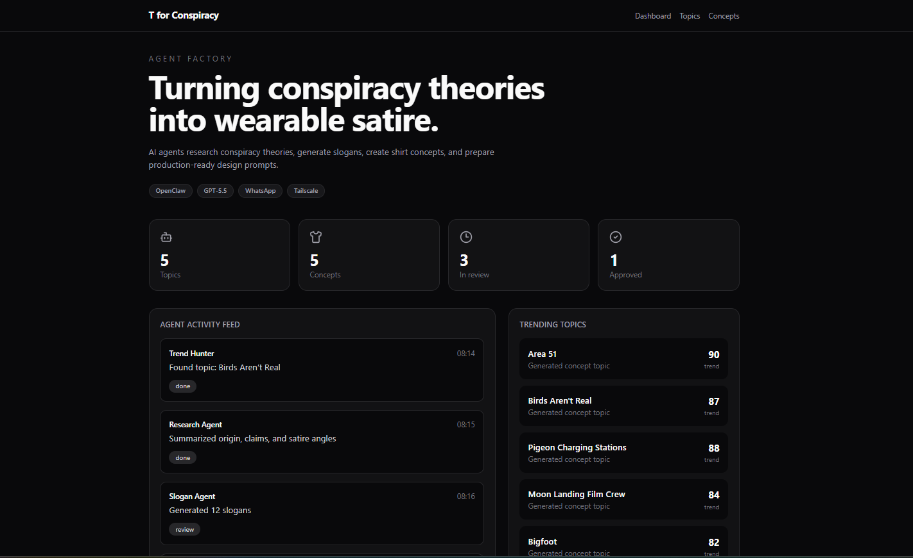
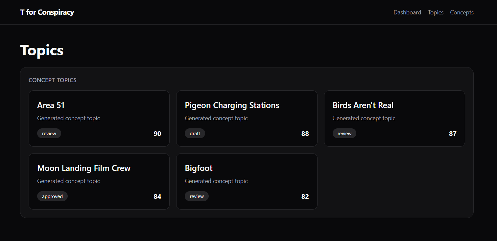
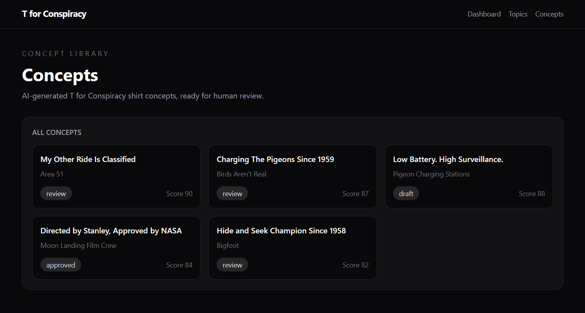

# T for Conspiracy Factory

An AI-powered merchandise concept platform that transforms internet conspiracy theories into satirical t-shirt concepts.

The project combines AI agents, WhatsApp automation, structured content generation, human review workflows, and a live dashboard to create a complete concept-to-approval pipeline.

## Live Demo

🌐 https://t4c-agent-factory.vercel.app





## Demo Workflow

```text
WhatsApp
    ↓
OpenClaw Agent
    ↓
GPT-5.5
    ↓
POST /api/agent/concepts
    ↓
Neon Postgres
    ↓
Next.js Dashboard
    ↓
Human Approval
```

## Features

### AI Concept Generation

- Generate satirical merchandise concepts
- Create slogans, descriptions, and design prompts
- Score concepts automatically
- Store generated concepts in Neon Postgres

### Human Review Workflow

- Review generated concepts
- Approve, reject, or request improvements
- Track concept status through the dashboard

### Agent Ingestion API

AI agents can create concepts through a secured API endpoint:

```http
POST /api/agent/concepts
```

### Dashboard

- Live concept library
- Trending conspiracy topics
- Agent activity feed
- Approval status tracking
- Database-driven metrics

## Tech Stack

### Frontend

- Next.js (App Router)
- React
- TypeScript
- Tailwind CSS

### Backend

- Next.js Route Handlers
- Prisma ORM
- Neon Postgres

### AI & Automation

- OpenClaw
- GPT-5.5
- WhatsApp Channel
- Tailscale

### Deployment

- Vercel
- Neon

## Architecture

```text
┌─────────────┐
│  WhatsApp   │
└──────┬──────┘
       │
       ▼
┌─────────────┐
│    Mira     │
│ OpenClaw AI │
└──────┬──────┘
       │
       ▼
┌────────────────────┐
│ Agent API Endpoint │
└─────────┬──────────┘
          │
          ▼
┌────────────────────┐
│ Neon PostgreSQL    │
└─────────┬──────────┘
          │
          ▼
┌────────────────────┐
│ Next.js Dashboard  │
└────────────────────┘
```


## This project explores

- AI agent orchestration
- Structured AI outputs
- Human-in-the-loop workflows
- Database-backed AI systems
- API-first agent design
- Prompt engineering
- Full-stack deployment pipelines

## Work in progress

- Multi-agent workflow
- Automated image generation
- AI-assisted concept review
- Production-ready approval system
- Concept-to-mockup pipeline
- Merchandise storefront integration

## Running Locally

Install dependencies:

```bash
npm install
```

Create a local environment file:

```env
DATABASE_URL=
AGENT_API_KEY=
```

Run the development server:

```bash
npm run dev
```

Open:

```text
http://localhost:3000
```
